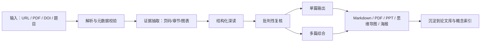

# 论文阅读工作台

这是一套面向机器人、具身智能和 Agent 领域的论文阅读框架。目标不是只生成一段摘要，而是把一篇论文转成：

- 可核验的结论和证据链；
- 结构化的方法、实验、局限分析；
- 图文 PDF、PPT、思维导图等不同深度的输出；
- 可跨论文累积的阅读与比较资料。

以后可以直接在 Codex 中说：

```text
读：https://arxiv.org/abs/2210.03629
```

或：

```text
深读这三篇并做横向综述：
<链接1>
<链接2>
<链接3>
```

或：

```text
把这篇论文做成 12 页 PPT，机器人方向，重点讲方法和真机实验：
<链接>
```

## 总体架构



核心原则：

1. **解析层**负责把 PDF 变成可靠文本、图表和公式。
2. **证据层**负责把结论绑定到页码、章节、图和表。
3. **理解层**负责讲清问题、方法、实验、局限和可迁移点。
4. **输出层**按用途重新组织，而不是把同一段摘要换格式。

## 默认深读包

对一篇论文，默认生成：

```text
outputs/<paper_id>/
├── 00_one_page.md
├── 01_deep_note.md
├── mindmap.mmd
└── deck_storyboard.md

papers/library/<paper_id>/
└── evidence.jsonl
```

默认只生成源文件和提纲。用户明确要求时，再渲染为图文 PDF、PPT、SVG/HTML 思维导图或海报。

## 工作区结构

```text
.
├── AGENTS.md
├── README.md
├── config/
│   └── reading_profile.json
├── paper_reading/
│   ├── WORKFLOW.md
│   ├── GITHUB_SOURCES.md
│   ├── AGENT_ROBOTICS_TAXONOMY.md
│   ├── templates/
│   ├── prompts/
│   └── schemas/
├── papers/
│   ├── inbox/
│   └── library/
├── outputs/
└── scripts/
    └── paper_workspace.py
```

## 快速开始

初始化一篇论文：

```bash
python3 scripts/paper_workspace.py init \
  --paper-id yao-2022-react \
  --title "ReAct: Synergizing Reasoning and Acting in Language Models" \
  --source "https://arxiv.org/abs/2210.03629" \
  --domain agent
```

查看论文状态：

```bash
python3 scripts/paper_workspace.py status
```

检查输出是否完整：

```bash
python3 scripts/paper_workspace.py validate yao-2022-react
```

初始化后，把 PDF 放到：

```text
papers/library/yao-2022-react/source/
```

然后在 Codex 中直接发送：

```text
深读 papers/library/yao-2022-react/source/paper.pdf
```

## 常用阅读模式

| 模式 | 适用场景 | 主要产出 |
|---|---|---|
| 快速判断 | 判断论文是否值得读 | 一页卡、贡献判断、风险 |
| 标准深读 | 理解一篇核心论文 | 默认深读包 |
| 复现导向 | 准备跑代码或复现实验 | 环境、数据、训练、指标、缺口清单 |
| 方法迁移 | 为自己的研究找思路 | 机制抽象、可迁移模块、假设 |
| 多篇综述 | 做方向调研或开题 | 对比矩阵、趋势、争议、研究空白 |
| 输出制作 | 组会、答辩、汇报 | 图文 PDF、PPT、思维导图、海报 |

## 当前采用的 GitHub 方案

详细筛选和取舍见 [paper_reading/GITHUB_SOURCES.md](paper_reading/GITHUB_SOURCES.md)。结论是：

- 用 PaperQA2 作为论文 RAG、引用问答和矛盾检测参考。
- 用 MinerU 作为复杂 PDF 到 Markdown/JSON 的解析参考。
- 用 GPT Paper Assistant 作为每日 arXiv 发现和相关性打分参考。
- 用 GPT Researcher 作为多问题规划、并行调研和报告生成参考。
- 用 ASReview 作为多篇论文筛选和主动学习式系统综述参考。
- 用 ML-Papers-Explained 作为人类可读解释的组织参考。
- 用 LLMAgentPapers、LLM-Agents-Papers、Embodied-AI-Guide 提炼领域阅读维度。
- 用 Paper2Poster、PPTAgent 作为论文转海报和演示材料的输出参考。

目前不直接强依赖这些项目，因为它们各自只覆盖流程的一段，而且完整安装会增加 API、GPU、模型下载和维护成本。框架先把接口、模板和质量门槛定下来，后续可按需要逐项接入。

## 可选增强

### PaperQA2

适合本地论文库问答、带引用回答和矛盾检测：

```bash
pip install "paper-qa>=5"
```

### MinerU

适合复杂 PDF 的版面、公式、表格和图像解析：

```bash
pip install -U "mineru[all]"
```

### Markmap

把 `mindmap.mmd` 或 Markdown 标题树渲染为交互式 HTML、SVG 或 PDF：

```bash
npx markmap-cli mindmap.md -o mindmap.html
```

## 质量标准

一份合格的精读材料必须做到：

- 核心结论有页码、章节或图表定位；
- 明确区分作者主张和独立判断；
- 复述实验设置、基线、指标和数据规模；
- 指出失败案例、适用边界、成本和可复现性风险；
- 对图进行解释，而不是把图当装饰；
- 输出格式改变时，叙事结构也随用途改变。

具体执行标准见 [paper_reading/WORKFLOW.md](paper_reading/WORKFLOW.md)。
