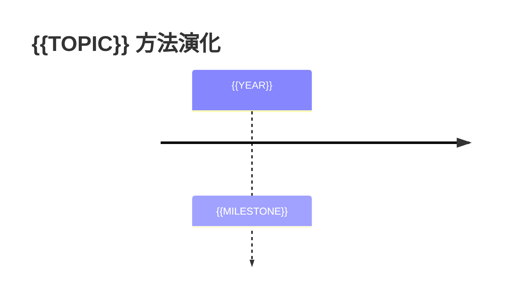

# 多论文比较矩阵

## 研究问题

{{RESEARCH_QUESTIONS}}

## 纳入与排除标准

- 纳入：{{INCLUDE}}
- 排除：{{EXCLUDE}}

## 比较矩阵

| Paper | 任务/环境 | 核心方法 | 状态/动作表示 | 数据与训练 | 评测 | 主要结果 | 最强证据 | 主要局限 |
|---|---|---|---|---|---|---|---|---|
| {{PAPER}} | {{TASK}} | {{METHOD}} | {{STATE_ACTION}} | {{DATA_TRAINING}} | {{EVAL}} | {{RESULT}} | {{EVIDENCE}} | {{LIMITATION}} |

## 公平性检查

| Paper | 基线是否公平 | 算力/数据是否可比 | 评测是否一致 | 复现风险 |
|---|---|---|---|---|
| {{PAPER}} | {{FAIRNESS}} | {{COMPUTE}} | {{EVAL}} | {{REPRO}} |

## 共识

1. {{CONSENSUS}}

## 分歧

1. {{DISAGREEMENT}}

## 方法演化

## 证据最强的结论

- {{STRONG_CONCLUSION}}

## 仍无法判断的问题

- {{UNCERTAIN}}
